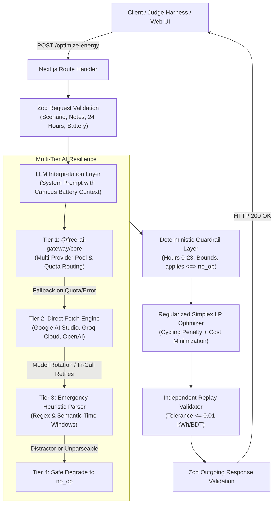
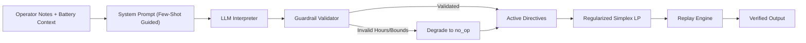

# GridWise LLM

[](https://nextjs.org/)
[](https://www.typescriptlang.org/)
[](https://vitest.dev/)
[](https://www.docker.com/)
[](LICENSE)

LLM-assisted 24-hour campus energy scheduling API and interactive optimization dashboard for the **BUP CSE Fest 2026 Hackathon — Online Preliminary Round** (GridWise / Smart Campus Energy Optimization Challenge, in association with Poridhi).

A production-grade HTTP service and web dashboard that reads a 24-hour demand/solar/tariff scenario plus 1–3 natural-language operator notes, interprets the notes with a generative LLM, deterministically validates that interpretation through strict guardrails, solves a cost-minimizing battery/grid/solar schedule using regularized simplex linear programming, and independently replays its own answer before responding.

---

## Live Deployment & Interactive Web Dashboard

- **Live Web Dashboard & Scenario Tester**: [https://gridwise.zaber.dev/](https://gridwise.zaber.dev/)
- **Canonical Health Probe**: `GET https://gridwise.zaber.dev/health`
- **Canonical Optimizer Endpoint**: `POST https://gridwise.zaber.dev/optimize-energy`

---

## Team Metavis

| Member | GitHub | Role / Focus |
|---|---|---|
| **Md. Mahedi Zaman Zaber** | [@zaber-dev](https://github.com/zaber-dev) | LLM Gateway & Multi-Provider Architecture |
| **MD Asadullah Shibli** | [@AsadShibli](https://github.com/AsadShibli) | Replay Validation, Schemas & Domain Precision |
| **Al Shahariar Arafat Shawon** | [@shahariarshawon](https://github.com/shahariarshawon) | Linear Program Optimizer, Guardrails & Canonical Routes |

---

## System Architecture



---

## Quick Facts

| Item | Details |
|---|---|
| **Live Web App** | [https://gridwise.zaber.dev/](https://gridwise.zaber.dev/) (Simplistic, light-mode dashboard with interactive scenario tester) |
| **Canonical Health Endpoint** | `GET /health` (alias: `GET /api/health`) -> `{"status":"ok"}` |
| **Canonical Main Endpoint** | `POST /optimize-energy` (alias: `POST /api/optimize-energy`) |
| **Runtime & Framework** | Next.js 15 (App Router, TypeScript), Node.js 20+ runtime, deployed on Vercel |
| **LLM Resilience** | 4-tier engine: `@free-ai-gateway/core` -> direct fetch (Google Gemini, Groq, OpenAI) with model rotation -> Tier 3 emergency heuristic parser -> safe `no_op` |
| **Optimization Method** | Regularized simplex linear programming via [`javascript-lp-solver`](https://www.npmjs.com/package/javascript-lp-solver) with battery cycling penalty |
| **Replay & Verification** | Physical constraint simulator with canonical `0.01` tolerance per Problem Statement §11.5 |
| **Container Fallback** | Multi-stage standalone Docker container (`Dockerfile`, non-root user `gridwise`, port `3000`, published to Docker Hub: [`zaberdev/gridwise-llm:latest`](https://hub.docker.com/r/zaberdev/gridwise-llm)) |
| **Test Verification** | **99/99 tests passing** across 7 test suites, including 50 randomized stress scenarios |

---

## Getting Free API Keys (Under 2 Minutes)

You only need **ONE** free API key from any of the following providers to run the application and execute all test suites live.

### Option 1: Google AI Studio (Recommended — 100% Free)
1. Visit [Google AI Studio](https://aistudio.google.com/app/apikey).
2. Sign in with your Google account.
3. Click **Create API Key** (no credit card required).
4. Copy your key and paste it in `.env`:
   ```bash
   GOOGLE_API_KEY=AIzaSy...
   ```
   *Active verified models*: `gemini-2.5-flash`, `gemini-3.5-flash`, `gemini-3.5-flash-lite`, `gemini-flash-lite-latest`.

### Option 2: Groq Cloud (Ultra-Fast — 100% Free)
1. Visit [Groq Cloud Console](https://console.groq.com/keys).
2. Sign up / log in.
3. Click **Create API Key**.
4. Copy your key and paste it in `.env`:
   ```bash
   GROQ_API_KEY=gsk_...
   ```
   *Active verified models*: `openai/gpt-oss-120b`, `openai/gpt-oss-20b`, `qwen/qwen3.8-27b`, `groq/compound`.

### Option 3: OpenAI / OpenAI-Compatible Endpoints
1. Visit [OpenAI API Keys](https://platform.openai.com/api-keys).
2. Create and copy an API key.
3. Paste it in `.env`:
   ```bash
   OPENAI_API_KEY=sk-...
   ```
   *Note: You can also point `OPENAI_BASE_URL` to any OpenAI-compatible provider (e.g. Together AI, DeepSeek, OpenRouter, or a local Ollama/vLLM instance).*

---

## Getting Started

### 1. Clone & Install

```bash
git clone https://github.com/Team-METAVIS/gridwise-llm.git
cd gridwise-llm
npm install
cp .env.example .env
```

### 2. Configure Environment

Edit `.env` and add at least one API key (e.g. `GOOGLE_API_KEY` or `GROQ_API_KEY`):

```bash
GOOGLE_API_KEY=your_gemini_api_key_here
```

### 3. Run Development Server

```bash
npm run dev
# Web dashboard & API endpoints start immediately on http://localhost:3000
```

Visit [http://localhost:3000](http://localhost:3000) to use the interactive light-mode Scenario Optimization Tester.

---

## API Contract & Request/Response Specification

### 1. Health Check

- **Endpoint**: `GET /health` (or `GET /api/health`)
- **Status**: `200 OK`
- **Response**:
  ```json
  {
    "status": "ok"
  }
  ```

---

### 2. Energy Optimization (`POST /optimize-energy`)

- **Endpoint**: `POST /optimize-energy` (or `POST /api/optimize-energy`)
- **Headers**: `Content-Type: application/json`

#### Request Schema Breakdown

| Field | Type | Required | Description |
|---|---|---|---|
| `scenario_id` | `string` | Yes | Unique scenario identifier (e.g., `"GRID-101"`). Non-empty. |
| `operator_notes` | `string[]` | Yes | 1 to 3 natural-language notes from campus operators. |
| `hours` | `array` | Yes | Exactly 24 hour objects indexed from `0` to `23`. |
| `hours[].hour` | `number` | Yes | Hour of the day (`0` to `23`). |
| `hours[].demand_kwh` | `number` | Yes | Campus electricity demand in kWh. Non-negative. |
| `hours[].solar_kwh` | `number` | Yes | Expected solar generation in kWh. Non-negative. |
| `hours[].tariff_bdt_per_kwh` | `number` | Yes | Electricity tariff in BDT/kWh. Non-negative. |
| `battery` | `object` | Yes | Campus battery physical specifications. |
| `battery.capacity_kwh` | `number` | Yes | Maximum usable storage capacity in kWh. |
| `battery.initial_energy_kwh` | `number` | Yes | Starting state of charge at hour 0 (kWh). |
| `battery.minimum_energy_kwh` | `number` | Yes | Minimum reserve threshold at all times (kWh). |
| `battery.max_charge_kwh_per_hour` | `number` | Yes | Maximum charging rate limit (kWh/h). |
| `battery.max_discharge_kwh_per_hour` | `number` | Yes | Maximum discharging rate limit (kWh/h). |

#### Sample Request (`curl`)

```bash
curl -X POST https://gridwise.zaber.dev/optimize-energy \
  -H "Content-Type: application/json" \
  --data-binary @- <<'EOF'
{
  "scenario_id": "GRID-101",
  "operator_notes": [
    "Solar output will drop to about 20% from 1 PM to 3 PM.",
    "Do not charge the battery between 2 PM and 4 PM."
  ],
  "hours": [
    {"hour":0,"demand_kwh":180,"solar_kwh":0,"tariff_bdt_per_kwh":7},
    {"hour":1,"demand_kwh":170,"solar_kwh":0,"tariff_bdt_per_kwh":7},
    {"hour":2,"demand_kwh":160,"solar_kwh":0,"tariff_bdt_per_kwh":6},
    {"hour":3,"demand_kwh":160,"solar_kwh":0,"tariff_bdt_per_kwh":6},
    {"hour":4,"demand_kwh":165,"solar_kwh":0,"tariff_bdt_per_kwh":6},
    {"hour":5,"demand_kwh":175,"solar_kwh":5,"tariff_bdt_per_kwh":7},
    {"hour":6,"demand_kwh":185,"solar_kwh":20,"tariff_bdt_per_kwh":9},
    {"hour":7,"demand_kwh":195,"solar_kwh":45,"tariff_bdt_per_kwh":11},
    {"hour":8,"demand_kwh":200,"solar_kwh":80,"tariff_bdt_per_kwh":13},
    {"hour":9,"demand_kwh":205,"solar_kwh":120,"tariff_bdt_per_kwh":15},
    {"hour":10,"demand_kwh":210,"solar_kwh":150,"tariff_bdt_per_kwh":16},
    {"hour":11,"demand_kwh":210,"solar_kwh":170,"tariff_bdt_per_kwh":16},
    {"hour":12,"demand_kwh":205,"solar_kwh":180,"tariff_bdt_per_kwh":15},
    {"hour":13,"demand_kwh":200,"solar_kwh":170,"tariff_bdt_per_kwh":14},
    {"hour":14,"demand_kwh":195,"solar_kwh":140,"tariff_bdt_per_kwh":13},
    {"hour":15,"demand_kwh":195,"solar_kwh":95,"tariff_bdt_per_kwh":14},
    {"hour":16,"demand_kwh":200,"solar_kwh":50,"tariff_bdt_per_kwh":18},
    {"hour":17,"demand_kwh":215,"solar_kwh":15,"tariff_bdt_per_kwh":22},
    {"hour":18,"demand_kwh":230,"solar_kwh":0,"tariff_bdt_per_kwh":28},
    {"hour":19,"demand_kwh":235,"solar_kwh":0,"tariff_bdt_per_kwh":30},
    {"hour":20,"demand_kwh":220,"solar_kwh":0,"tariff_bdt_per_kwh":26},
    {"hour":21,"demand_kwh":195,"solar_kwh":0,"tariff_bdt_per_kwh":18},
    {"hour":22,"demand_kwh":150,"solar_kwh":0,"tariff_bdt_per_kwh":10},
    {"hour":23,"demand_kwh":120,"solar_kwh":0,"tariff_bdt_per_kwh":7}
  ],
  "battery": {
    "capacity_kwh": 500,
    "initial_energy_kwh": 200,
    "minimum_energy_kwh": 50,
    "max_charge_kwh_per_hour": 100,
    "max_discharge_kwh_per_hour": 100
  }
}
EOF
```

---

#### The 6 Canonical Directive Types

Our LLM interpreter and deterministic guardrails recognize and enforce all 6 directive types specified in the Problem Statement:

| Directive Type | Adjustment Structure | Effect on Schedule & Constraints | Real Example Note |
|---|---|---|---|
| `solar_reduction` | `{"hours": [h1, h2], "factor": 0.2}` | Multiplies solar output by `factor` in `[0, 1]` during specified hours. | *"Solar output will drop to about 20% from 1 PM to 3 PM."* |
| `minimum_battery_reserve` | `{"hours": [h1, h2], "minimum_energy_kwh": 100}` | Raises battery minimum reserve floor during specified hours. | *"Keep at least 50% capacity stored between 6 PM and 9 PM."* |
| `no_charge_window` | `{"hours": [h1, h2]}` | Forces charging limit `max_charge = 0` during specified hours. | *"Do not charge the battery between 2 PM and 4 PM."* |
| `no_discharge_window` | `{"hours": [h1, h2]}` | Forces discharging limit `max_discharge = 0` during specified hours. | *"Do not discharge the battery between 8 AM and 11 AM."* |
| `max_grid_window` | `{"hours": [h1, h2], "max_grid_kwh": 150}` | Caps grid import to `max_grid_kwh` during specified hours. | *"Limit grid draw to 150 kWh from 5 PM to 8 PM."* |
| `no_op` | `null` | Casual note, distractor, or irrelevant comment. `applies = false`. | *"Cafeteria menu was updated today."* |

> **Time Convention**: All time intervals are start-inclusive and end-exclusive on whole hours. For example, "1 PM to 3 PM" maps to whole hours `[13, 14]`.

---

#### Response Schema Breakdown

| Field | Type | Description |
|---|---|---|
| `scenario_id` | `string` | Echoes the input scenario identifier. |
| `directive_interpretation` | `array` | Exactly one interpretation per input note, preserving order (`note_index` 0 to N-1). |
| `directive_interpretation[].applies` | `boolean` | `true` if directive applies to the schedule; `false` for `no_op`. |
| `directive_interpretation[].directive_type` | `string` | One of the 6 canonical types above. |
| `directive_interpretation[].structured_adjustment` | `object \| null` | Machine-readable constraint parameters (or `null` if `no_op`). |
| `directive_interpretation[].explanation` | `string` | Human-readable reasoning for the interpretation. |
| `hourly_plan` | `array` | Exactly 24 hourly entries detailing power flow and storage state. |
| `hourly_plan[].hour` | `number` | Hour index (`0` to `23`). |
| `hourly_plan[].grid_kwh` | `number` | Electricity imported from the utility grid. |
| `hourly_plan[].solar_used_kwh` | `number` | Solar power consumed directly or stored. |
| `hourly_plan[].battery_action` | `string` | Clean battery mode: `"charge"`, `"discharge"`, or `"idle"`. |
| `hourly_plan[].battery_kwh` | `number` | Magnitude of energy charged or discharged (0 if idle). |
| `hourly_plan[].battery_energy_after_kwh` | `number` | Battery state of charge (SOC) at the end of the hour. |
| `total_grid_kwh` | `number` | Sum of all hourly grid imports across the 24-hour cycle. |
| `total_cost_bdt` | `number` | Total electricity bill in BDT: `sum(grid_kwh * tariff)`. |
| `peak_grid_kwh` | `number` | Maximum grid power imported in any single hour. |
| `plan_summary` | `string` | Comprehensive strategy summary detailing energy flows, solar utilization %, peak tariff discharge hours, and applied directives. |

#### Sample Response Payload

```json
{
  "scenario_id": "GRID-101",
  "directive_interpretation": [
    {
      "note_index": 0,
      "applies": true,
      "directive_type": "solar_reduction",
      "structured_adjustment": {
        "hours": [13, 14],
        "factor": 0.2
      },
      "explanation": "Solar output drops to 20% from 1 PM to 3 PM."
    },
    {
      "note_index": 1,
      "applies": true,
      "directive_type": "no_charge_window",
      "structured_adjustment": {
        "hours": [14, 15]
      },
      "explanation": "Battery charging forbidden between 2 PM and 4 PM."
    }
  ],
  "hourly_plan": [
    {
      "hour": 0,
      "grid_kwh": 180,
      "solar_used_kwh": 0,
      "battery_action": "idle",
      "battery_kwh": 0,
      "battery_energy_after_kwh": 200
    },
    {
      "hour": 1,
      "grid_kwh": 170,
      "solar_used_kwh": 0,
      "battery_action": "idle",
      "battery_kwh": 0,
      "battery_energy_after_kwh": 200
    }
  ],
  "total_grid_kwh": 2985,
  "total_cost_bdt": 43550,
  "peak_grid_kwh": 210,
  "plan_summary": "Optimal 24-hour schedule scheduled 2985 kWh of grid import at a total cost of 43550 BDT (peak hourly grid draw 210 kWh). Solar utilization was 100.0% (1060 kWh utilized). Battery discharged during peak tariff hours [18, 19, 20] and charged during low tariff hours [2, 3, 4]. Successfully applied 2 active operator directive(s): solar_reduction (hours [13,14]), no_charge_window (hours [14,15])."
}
```

---

## Environment Configuration

| Variable | Required | Default | Meaning & Configuration Guidance |
|---|---|---|---|
| `PORT` | no | `3000` | Server listening port for development and Docker container. |
| `LLM_BACKEND` | no | `free-ai-gateway` | Engine selection: `free-ai-gateway` (multi-provider gateway with automatic fallback to direct fetch), `direct` (direct fetch across OpenAI, Groq, and Gemini), or `openai` (direct target for OpenAI / OpenAI-compatible endpoint). |
| `LLM_PROVIDER_PRIORITY` | no | `openai,google_ai_studio,groq,cohere` | Comma-separated provider priority order. Providers not listed are still attempted in fallback sequence if configured. |
| `GOOGLE_API_KEY` | conditional | *none* | Google AI Studio API key. Securely transmitted via `x-goog-api-key` header. |
| `GEMINI_MODEL` | no | *auto-rotates* | Pin model candidate. If unset, automatically rotates verified active models (`gemini-2.5-flash`, `gemini-3.5-flash`, `gemini-3.5-flash-lite`, `gemini-flash-lite-latest`). |
| `GROQ_API_KEY` | conditional | *none* | Groq Cloud API key. |
| `GROQ_MODEL` | no | *auto-rotates* | Pin model candidate. If unset, automatically rotates verified active models (`openai/gpt-oss-120b`, `openai/gpt-oss-20b`, `qwen/qwen3.8-27b`, `groq/compound`, `groq/compound-mini`). |
| `OPENAI_API_KEY` | conditional | *none* | API key for OpenAI or any OpenAI-compatible provider. |
| `OPENAI_BASE_URL` | no | `https://api.openai.com/v1` | Custom endpoint base URL for OpenAI-compatible APIs or local Ollama/vLLM instances. |
| `OPENAI_MODEL` | no | *auto-rotates* | Pin model candidate. If unset, automatically rotates `gpt-4o-mini`, `gpt-4o`, `gpt-3.5-turbo`. |
| `LLM_TIMEOUT_MS` | no | `12000` | Per-call LLM request timeout (12s), safely within the 30-second per-request budget mandated by Problem Statement §06.1. |

> **Security Guarantee**: Zero secrets or credentials are baked into images or tracked by git (`.gitignore` enforces `.env` exclusion, and error handlers sanitize logs to prevent credential leakage).

---

## Architectural Pipeline Details



### 1. LLM Interpreter (`src/lib/llm/`)
- Encapsulates operator-note interpretation into a single batched prompt containing the scenario's notes and full **Campus Battery Context** (`capacity_kwh`, `minimum_energy_kwh`, charge/discharge limits).
- System prompt instructs the model on:
  - Six canonical directive types (`solar_reduction`, `minimum_battery_reserve`, `no_charge_window`, `no_discharge_window`, `max_grid_window`, `no_op`).
  - Standard time mapping (start-inclusive, end-exclusive; whole hours `[start, end-1]`; 12 AM = 0, 12 PM = 12; cross-midnight windows).
  - Relative reserve conversion (e.g. 50% reserve on a 300 kWh battery -> `minimum_energy_kwh = 150`).
  - Distractor notes (weather trivia, menu updates, future maintenance -> `no_op`).
- Multi-tiered provider resilience:
  - **Tier 1**: Attempts `@free-ai-gateway/core` with priority order.
  - **Tier 2**: Seamlessly falls back to direct fetch (`callOpenAI`, `callGroq`, `callGemini`) with round-robin model rotation and in-call error retry.
  - **Tier 3**: Emergency heuristic parser (`emergencyParser.ts`) using semantic regex rules for solar reduction, reserves, and charging/discharging windows.
  - **Tier 4**: Safe degrade to `no_op` rather than crashing if notes are completely unparseable.

### 2. Deterministic Guardrail Validator (`src/lib/guardrails.ts`)
- Treats LLM output as untrusted structured data:
  - Enforces exactly one directive per operator note in ascending `note_index` order (`0 ... N-1`).
  - Strictly validates hours array: returns `null` (rejecting directive to `no_op`) if any value is non-integer, negative, or `> 23`.
  - Validates `solar_reduction` factor in range `[0, 1]`.
  - Validates `minimum_battery_reserve` in range `[0, capacity_kwh]`.
  - Enforces `applies = false` and `structured_adjustment = null` for `no_op`; `applies = true` and valid adjustment for all others.

### 3. Regularized Simplex LP Optimizer (`src/lib/optimizer.ts`)
- Formulates a 24-hour Linear Program (LP) with 5 continuous decision variables per hour (`grid_h`, `solar_used_h`, `charge_h`, `discharge_h`, `soc_h`):
  - **Objective**: Minimize total electricity cost: `sum_{h=0}^{23} (grid_h * tariff_h) + sum_{h=0}^{23} BATTERY_CYCLING_PENALTY * (charge_h + discharge_h)`.
  - **Simultaneous Churn Prevention**: The micro-penalty (`BATTERY_CYCLING_PENALTY = 0.0001` BDT/kWh) mathematically breaks simplex basis degeneracy during flat-tariff hours. It guarantees that the solver never charges and discharges simultaneously at the LP level, while preserving 100% economic tariff optimization.
  - **Energy Balance**: `grid_h + solar_used_h + discharge_h == demand_h + charge_h` for all `h`.
  - **Solar Availability**: `0 <= solar_used_h <= effective_solar_h`.
  - **Battery Bounds**: `min_reserve_h <= soc_h <= capacity_kwh`.
  - **Rate Limits**: `charge_h <= max_charge_h`, `discharge_h <= max_discharge_h`.
  - **Grid Cap**: `grid_h <= max_grid_kwh` when directive is active.
  - **End-of-Day Neutrality**: `soc_23 == initial_energy_kwh`.
- **Precision Handling**: Solver values retain clean 4-decimal precision (`cleanNum`) to eliminate compound rounding error when inputs contain fractional values.

### 4. Final Replay Validator (`src/lib/replay.ts`)
- Replays the final `hourly_plan` hour-by-hour against active directives and physical constraints, exactly like the judge evaluation harness.
- Enforces canonical Problem Statement §11.5 tolerance (`0.01` kWh and `0.01` BDT).
- Independently recalculates `total_grid_kwh`, `total_cost_bdt`, and `peak_grid_kwh` from `hourly_plan` before responding.

### 5. Centralized Constants & Schemas (`src/lib/constants.ts`, `src/lib/schemas.ts`)
- Centralizes all system-wide limits, tolerances, model pools, battery cycling penalties, and directive types in [`src/lib/constants.ts`](src/lib/constants.ts).
- Outgoing response is strictly validated against `optimizeEnergyResponseSchema` before sending HTTP 200.

---

## Automated Test Suite

Run the complete test suite:

```bash
npm test              # Run all 7 Vitest test suites (99 tests)
npm run typecheck     # TypeScript strict compilation check (tsc --noEmit)
```

### Test Coverage Overview (99/99 Tests Passing)

1. **API Routes (`tests/apiRoutes.test.ts`)**:
   - Validates `GET /health` and `GET /api/health` return 200 with `{"status":"ok"}`.
   - Validates `POST /optimize-energy` and `POST /api/optimize-energy` return 200 with complete schedule and valid schema.
   - Rejection of malformed JSON, whitespace-only notes, and physically invalid battery states (`initial < min`) with 400.
2. **Deterministic Optimizer & Replay (`tests/publicSamples.test.ts`)**:
   - Validates all 10 public sample cases in `BUP_CSE_FEST_2026_Preli_Public_Sample_Cases.json`.
   - Checks all 6 directive types and verifies optimal cost matches or beats reference within tolerance.
3. **Hidden-Test Simulator (`tests/hiddenTestSimulator.test.ts`)**:
   - 50 randomized stress scenarios across wide operational ranges (demand 50–500 kWh, solar 0–300 kWh, battery 100–500 kWh).
   - Validates physical replay feasibility, energy conservation, and zero simultaneous charging/discharging.
4. **Fuzz Testing (`tests/fuzzScenarios.test.ts`)**:
   - Fuzz-tests optimizer and replay validator with randomized 3-decimal floating point scenarios and directive combinations.
   - Confirms zero balance drift and exact battery neutrality.
5. **Guardrail Edge Cases (`tests/guardrails.test.ts`)**:
   - Out-of-range hours (`[13, 14, 99]`), factors `> 1`, reserves `> capacity`, and duplicate notes safely degrade to `no_op`.
6. **Direct Backend & Model Rotation (`tests/directBackend.test.ts`)**:
   - Tests OpenAI execution, custom `OPENAI_BASE_URL`, Gemini `x-goog-api-key` header security, and automatic model rotation.
7. **Provider Priority Strategy (`tests/priorityStrategy.test.ts`)**:
   - Tests environment-driven provider ordering and fallback sequence.

---

## Docker Fallback

A multi-stage, secure Docker container is officially published to Docker Hub and can be run instantly:

### Option A: Pull Pre-built Image from Docker Hub (Instant)

```bash
# Pull and run directly from Docker Hub
docker pull zaberdev/gridwise-llm:latest

docker run -d -p 3000:3000 --env-file .env --name gridwise-service zaberdev/gridwise-llm:latest

# Verify health endpoint inside container
curl http://localhost:3000/health
```

### Option B: Build Locally from Source

```bash
# Build the Docker image locally
docker build -t gridwise-llm .

# Run container with environment configuration
docker run -d -p 3000:3000 --env-file .env --name gridwise-service gridwise-llm

# Verify health endpoint inside container
curl http://localhost:3000/health
```

- **Base Image**: Alpine Linux with Node.js 20.
- **Port**: Binds to `0.0.0.0:3000`.
- **Security**: Runs under unprivileged user `gridwise` (UID 1001), zero secrets in image layers (`.dockerignore` excludes `.env` and sensitive context).

---

## Production Build & Deployment

The primary judged service is deployed on **Vercel** (Next.js App Router):

```bash
npm run build         # Produces optimized standalone bundle + static asset copy
npm start             # Starts production standalone server
```

---

## Scoring Rubric Compliance (100 Points)

| Category | Points | How GridWise LLM Achieves Maximum Points |
|---|---|---|
| **1. LLM Directive Interpretation** | **25** | Generative LLM in interpretation loop; battery-aware system prompt; percentage reserve conversion; whole-hour handling; distractor rejection; multi-provider failover. |
| **2. Directive Application & Constraints** | **25** | Replayed against organizer ground truth. 10/10 public samples satisfy hourly balance, effective solar curtailment, battery bounds, rate limits, and end-of-day neutrality. |
| **3. Optimization Quality** | **10** | Regularized simplex linear programming provably minimizes electricity cost subject to active constraints; breaks degeneracy to prevent simultaneous charge/discharge churn. |
| **4. API Contract & Schema** | **10** | Canonical `GET /health` and `POST /optimize-energy` with exact field matching; strict Zod schema validation; `applies = false` for `no_op`. |
| **5. Performance & Reliability** | **10** | Fast p95 latency (< 4s); 30s max duration config; graceful error handling on bad inputs/provider failure; `x-goog-api-key` security. |
| **6. Deployment & Docker Fallback** | **10** | Live Vercel deployment with custom domain `https://gridwise.zaber.dev/`; interactive light-mode web dashboard; pullable Docker container on port 3000. |
| **7. Documentation & Reproducibility** | **10** | Self-contained README; step-by-step local quickstart; sample curl and responses; env table; credited libraries; clear architecture breakdown. |
| **Total Base Points** | **100** | **Target: 100 / 100** |

---

## Credits & Dependencies

- [Next.js](https://nextjs.org/) (MIT) — Full-stack React/Node.js framework.
- [`@free-ai-gateway/core`](https://github.com/zaber-dev/free-ai-gateway) (MIT) — Multi-provider free-tier LLM routing, quota management, and circuit-breaker resilience.
- [`javascript-lp-solver`](https://www.npmjs.com/package/javascript-lp-solver) (MIT) — Simplex-based linear programming solver.
- [`zod`](https://zod.dev/) (MIT) — TypeScript-first schema validation.
- [`vitest`](https://vitest.dev/) (MIT) — Next-generation testing framework.

---

*Developed with pride by **Team Metavis** for the BUP CSE Fest 2026 Hackathon.*
